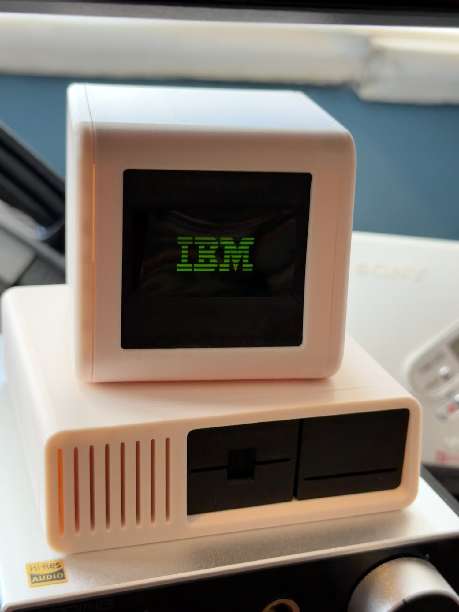

# IBM ESP32 MINI PC

This is a fork of the software running on [esp32retropc](https://github.com/eps32retropc/arduino) a tiny retro IBM PC by [Akira2007](https://www.reddit.com/r/esp32/comments/1r23liz/i_made_a_tiny_ibm_pc_model_powered_by_esp32_and/) / [chrismaddahl](https://makerworld.com/en/models/2380814-tiny-retro-ibm-pc-oled-hacker-matrix-pong-snake#profileId-2607098).

The original design and concept it completely theirs and I claim no ownership to it. The 3D printable files are available here: [Tiny Retro IBM PC](https://makerworld.com/en/models/2380814-tiny-retro-ibm-pc-oled-hacker-matrix-pong-snake#profileId-2607098)

Changes

1. Added IBM Logo to the loop of animations.

